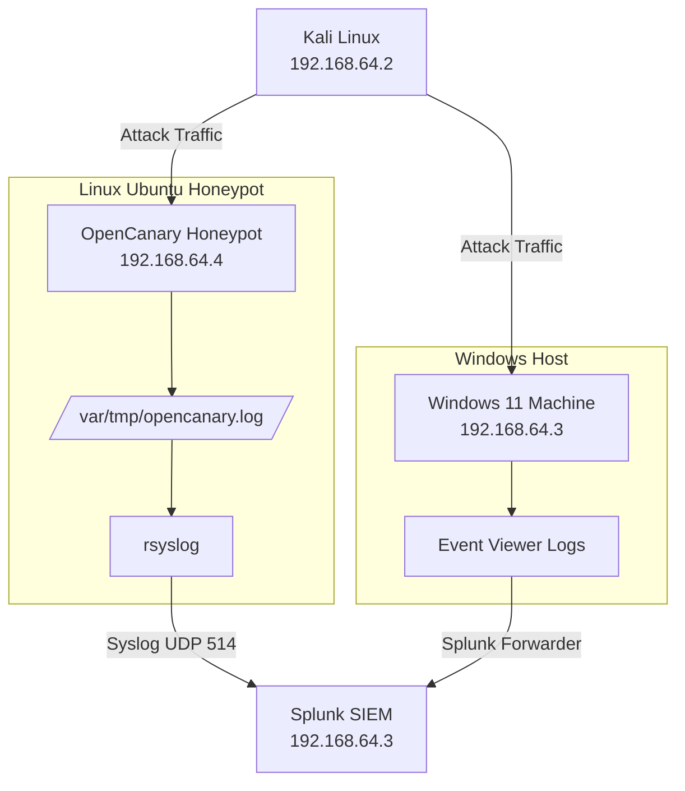

<h1>Honeypot / Local Detection Lab (OpenCanary + Splunk)</h1>

<b>Detection Lab Project</b> to simulate real-world attacker behavior using a honeypot installed on a Linux Ubuntu Server version 25.10, outputting information through rsyslog as well as a local Windows 11 machine outputting information through syslog to analyze information in Splunk.

<h2>Project Overview</h2>

<ul>
  <li>Set up and deployed a Kali Linux machine to perform attacks from</li>
  <li>Set up and deployed a Windows 11 machine to act as a target, but also to ingest and feed info to Splunk</li>
  <li>Installed Syslog and created basic configuration to feed events into Windows Event Viewer</li>
  <li>Splunk Universal Forwarder to ingest Windows Event Logs (Security, System, Application) into SIEM for detection and analysis</li>  
  <li>Set up and configured a Linux Ubuntu Server running version 25.10 to host a honeypot</li>
  <li>SSH'd into Ubuntu Server from Kali Linux machine to install OpenCanary Honeypot</li>
  <li>Configured honeypot services (SSH, FTP, HTTP) on common attack ports (2222, 21, 8080) to capture brute force and reconnaissance activity</li>
  <li>Deployed a honeypot to capture attacker activity</li>
  <li>Forwarded logs using rsyslog into Splunk using UDP connection over port 514</li>
  <li>Ingested data into Splunk SIEM</li>
  <li>Built detections and alerts along with a basic dashboard</li>
</ul>

<h2>Architecture</h2>

<h2>Detection Capabilities</h2>

<ul>
  <li>SSH brute force detection</li>
  <li>Port scanning detection</li>
  <li>GeoIP attack mapping</li>
  <li>Connection tracking by port</li>
</ul>

<h2>Screenshots</h2>

<i>(Add your screenshots here)</i>

<h3>Splunk Dashboard and Alerts</h3>
<li>Custom Alerts for unusual port activity</li>

<li>Dashboard showing basic Splunk dashboards, including HoneyPot logs</li>

<h3>OpenCanary</h3>
<li>OpenCanary startup interface showing ports used in HoneyPot</li>

<li>Logs accessed from Kali machine using SSH, showing brute force login attempts</li>

<li>HoneyPot logs aggregating from rsyslogs into Splunk through UDP port 514</li>

<h3>Configurations</h3>
<li>Custom Sysmon configuration</li>

<li>Simple OpenCanary configuration</li>

<h3>Attack Logs</h3>
<li>Splunk logs showing unauthorized user creation </li>

<li>Splunk logs showing reverse shell attack over port 4444 on Windows machine </li>

<h2>Resume Highlights</h2>

<ul>
  <li>Built and deployed a <b>honeypot-based detection lab</b> using OpenCanary</li>
  <li>Engineered a <b>log pipeline</b> using rsyslog into Splunk SIEM</li>
  <li>Developed <b>SPL detection queries</b> for brute force and scanning activity</li>
  <li>Simulated attacks using Kali Linux to validate detections</li>
</ul>

<h2>Tools & Technologies</h2>

<!-- Network -->
<h3>Network Analysis</h3>

  

<!-- Endpoint -->
<h3>Endpoint Security</h3>

  
  

<!-- SIEM -->
<h3>SIEM & Log Analysis</h3>

  

<!-- Log Pipeline -->
<h3>Log Pipeline</h3>

  
  

<!-- Platforms -->
<h3>Platforms</h3>

  
  
  

<h2>Future Improvements</h2>

<ul>
  <li>Alerting and automation</li>
  <li>MITRE ATT&CK mapping</li>
  <li>Cloud/VPS deployment</li>
  <li>Threat scoring system</li>
</ul>

